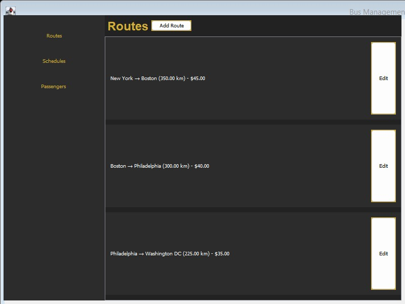
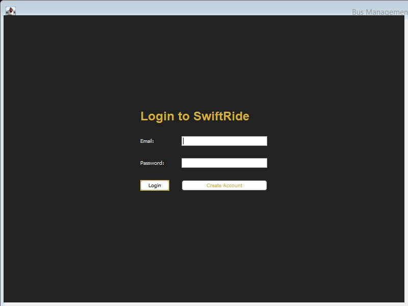

# Bus Ticket Booking System

A desktop bus booking app written in Java Swing, called SwiftRide. Admins manage routes and schedules, and passengers book and cancel seats.



## Features

- **Login and registration** with email and password. New users sign up as a passenger (name and passport number required) or as an admin
- **Admin dashboard** with a sidebar for Routes, Schedules, and Passengers
- **Manage routes.** Add or edit a route's start, destination, distance in km, and price. Empty fields and values of zero or less are rejected
- **Manage schedules.** Pick a route and set a departure date and time, then edit the time later
- **Passenger list** showing each passenger's name, email, and passport number
- **Sample routes** (New York to Boston, Boston to Philadelphia, Philadelphia to Washington DC) are added the first time an admin opens the dashboard and no routes exist yet
- **Browse and book.** Passengers see schedules grouped by route with the ticket price, and choose from the seats that are still free on a 40-seat bus
- **My Bookings** lists ticket number, seat, route, departure, and status. Cancelling asks for confirmation, marks the booking as Cancelled, and frees the seat
- **Saved to disk** in the `data/` folder, so accounts, routes, schedules, and bookings are kept between runs



## Run it

Needs JDK 16 or newer. Run the commands from inside the project folder, because the app reads and writes `data/` relative to the current directory.

```
cd "simple java bus system"
javac -encoding UTF-8 auth/*.java model/*.java View/*.java
java View.MainFrame
```

Log in as the built-in admin with `admin@bus.com` / `admin123`, or use **Create Account** to register a passenger.

## How it works

- `View.MainFrame` is the entry point. It holds `LoginPanel` and `RegisterPanel` in a `CardLayout` and, after login, replaces them with `AdminDashboard` or `PassengerDashboard` depending on the user type.
- `auth.Authentication` checks the built-in admin account first, then looks for a matching passenger in storage. `createAccount` refuses an email that is already registered.
- The model is an abstract `User` with `Admin` and `Passenger` subclasses, plus `Route`, `Schedule`, `Bus`, and `Booking`. A `Schedule` keeps the list of seat numbers still available, so booking removes a seat and cancelling puts it back.
- `model.DataStorage` keeps an in-memory cache of each list and writes the whole list with Java serialization (`ObjectOutputStream`) on a background thread. The files in `data/` end in `.txt` but hold binary data, not readable text.
- The dashboards load data on a background `ExecutorService` and update the screen through `SwingUtilities.invokeLater`, so the window does not freeze while files are read.

## Other version

`Bus 2nd version/` is a separate, simpler Swing implementation with no packages. It uses usernames instead of emails, two predefined admin accounts (`admin1` / `admin123` and `superadmin` / `super456`), schedules made of a route name, seat count, and price, and plain comma-separated files (`users.txt`, `schedules.txt`, `bookings.txt`) created in the folder it runs from. Passengers can book a seat by number, cancel, change seat, and search schedules by route, and booking opens a simulated payment dialog (Vodafone Cash or InstaPay).

```
cd "Bus 2nd version"
javac *.java
java Main
```

## Project structure

```
simple java bus system/
  View/
    MainFrame.java            window, screen switching, and main()
    LoginPanel.java           login form
    RegisterPanel.java        passenger and admin sign-up form
    AdminDashboard.java       routes, schedules, and passengers screens
    PassengerDashboard.java   schedule browsing, booking, and cancellation
  auth/
    Authentication.java       login and account creation
  model/
    User.java                 abstract base class for accounts
    Admin.java                admin account
    Passenger.java            passenger account with passport number
    Route.java                start, destination, distance, and price
    Schedule.java             departure time and available seats
    Bus.java                  bus model, capacity, and plate number
    Booking.java              ticket linking a passenger, seat, and schedule
    Payment.java              payment record (not used by the screens)
    DataStorage.java          cached, serialized file storage
  data/                       saved users, routes, schedules, and bookings
  swiftride_logo.png          logo image (not loaded by the code yet)
Bus 2nd version/              separate, simpler Swing version (see above)
screenshots/                  images used in this README
```
